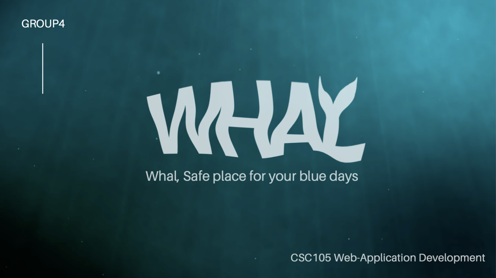
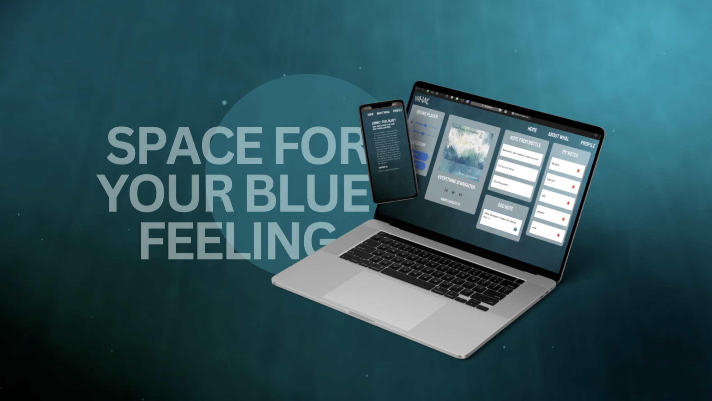

# WHAL 🐋
### Hackathon Project for CSC105 Web-App Development

 28 hours for Web development Hackathon, The Whal (วาฬ) project, a concept of space for your blue feeling.  
Imagine that we are all 52Hz, the loneliest whale in the world living indicidualy with blue feeling in the wild ocean 
 with the ballad song and messages from the bottles that was given from someone anonymous. 
 

 

  
## Feature 

 ✨ song displayer  
  ✨ encourage message give & recieve  
  ✨ rain / waves soundtrack  
  

 
 

   
  
